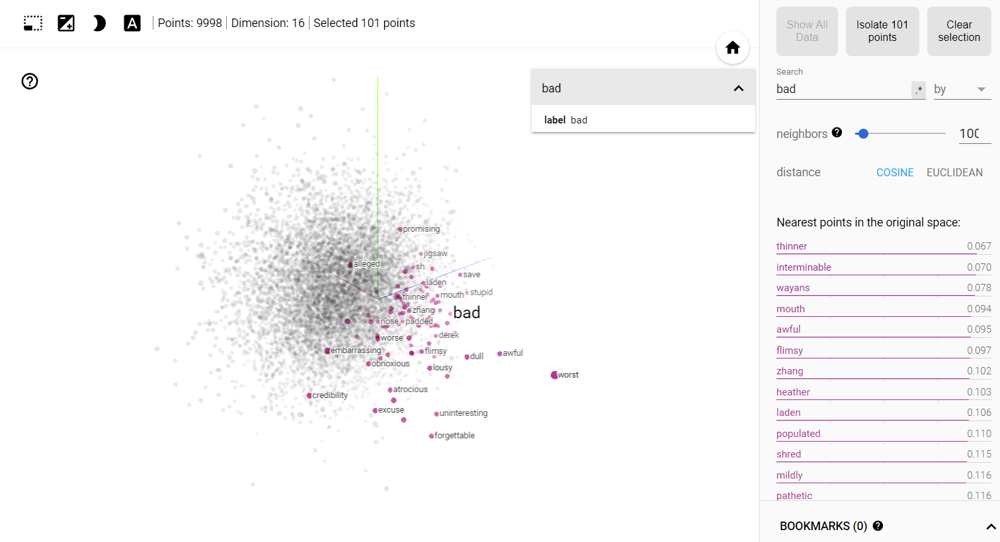

# Natural Language Processing
##### Tokenizing and Padding text
Tokenization is the process of breaking down a text into smaller units, such as words or subwords. In NLP, tokens are the basic building blocks for further processing. Understand the importance of tokenization and how it helps in text preprocessing.

Padding is a crucial step in text preprocessing, especially when dealing with sequences of varying lengths. In NLP tasks, such as text classification or sentiment analysis, it's common for input texts to have different lengths. However, neural networks typically require fixed-length input sequences. Padding is the process of adding special tokens (usually zeros) to the sequences to make them all the same length.

In the 'Tokenizer Folder' I learned how to tokenize words and sentences using tensorflow. I did even tokenize and pad sarcasm dataset using these methods.

##### Embedding and Classifying text
Embedding and classifying IMDb movie reviews involves preprocessing text data, embedding it into numerical representations, and building a classification model. Preprocessing includes tokenization and padding. Embedding converts text to vectors.
###### Tensorflow Embedding Projector
](<NLP text/Embedding/embedding.png>)
### Audio

